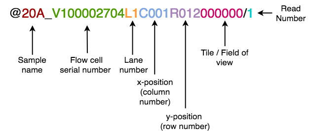

# BGI_vs_Illumina_Benchmark
This repository contains code related to the publication ["Comparative performance of the BGI and Illumina sequencing technology for single-cell RNA-sequencing"](https://doi.org/10.1093/nargab/lqaa034) by Senabouth et al. 2020.

If you find this tool useful, please cite the original manuscript:
Anne Senabouth, Stacey Andersen, Qianyu Shi, Lei Shi, Feng Jiang, Wenwei Zhang, Kristof Wing, Maciej Daniszewski, Samuel W Lukowski, Sandy S C Hung, Quan Nguyen, Lynn Fink, Anthony Beckhouse, Alice Pébay, Alex W Hewitt, Joseph E Powell, Comparative performance of the BGI and Illumina sequencing technology for single-cell RNA-sequencing, NAR Genomics and Bioinformatics, Volume 2, Issue 2, June 2020, lqaa034, https://doi.org/10.1093/nargab/lqaa034


## Sample Information
| Sample | Platforms                 | Sample Index | Projected number of cells | Chemistry                                 | Species      | Reference        | Cell Type                                                                          |
|--------|---------------------------|--------------|---------------------------|-------------------------------------------|--------------|------------------|------------------------------------------------------------------------------------|
| iPSC   | NextSeq 500, MGISEQ-2000  | SI-GA-A9     | 10,000                    | 10x Genomics Chromium Single Cell 3' (v2) | Homo sapiens | hg19             | Human induced pluripotent stem cells derived fibroblasts collected from two donors |
| TMWC   | NextSeq 500, MGISEQ-2000  | SI-GA-D4     | 20,000                    | 10x Genomics Chromium Single Cell 3' (v2) | Homo sapiens | GRCh38 + CROPseq | CRISPR screen of hIPSC-derived Trabecular Meshwork Cells                           |
| PBMC1  | NovaSeq 6000, MGISEQ-2000 | SI-GA-F1     | 20,000                    | 10x Genomics Chromium Single Cell 3' (v2) | Homo sapiens | GRCh38           | Peripheral Blood Mononuclear Cells collected from pools of donors                  |
| PBMC2  | NovaSeq 6000, MGISEQ-2000 | SI-GA-F2     | 20,000                    | 10x Genomics Chromium Single Cell 3' (v2) | Homo sapiens | GRCh38           | Peripheral Blood Mononuclear Cells collected from pools of donors                  |

## Data repository
Raw and processed data for both platforms are available via ArrayExpress ().

## Pre-processing
### Illumina datasets
FASTQ files were generated from BCL files using the [10x Genomics Cell Ranger version 2.2.0](https://support.10xgenomics.com/single-cell-gene-expression/software/pipelines/2.2/what-is-cell-ranger) *mkfastq* pipeline.

### BGI datasets
FASTQ files were generated from raw base calls using the Zebra Call software by BGI.

### Software Environment
The software environment required to run all stages of this study can be loaded in conda with the [environment.yml](config/environment.yml) file.

### Preparing data downloaded from ArrayExpress
Sequence from all sequencers were run in 4 sequencing lanes. For data generated by the MGISEQ-2000, reads are divided into an additional four files for each set of reads. These reads originally were originally associated with each sample index nucleotide sequence.

As sample indices weren't used for BGI sequencing, we added sample index barcodes to the BGI headers using [attachBarcodes.sh](preprocessing/attachBarcodes.sh). This is required for processing by the Cell Ranger pipeline.

If you are using this code for your own data, you may attach the barcode sequence as follows:

```bash
# Example BGI SAMPLE NAME
BGI_ID=20A_V100002704 
SAMPLE_ID=C0072_A9

# Set of sample index barcodes from 10x Genomics
declare -a INDEX_BARCODES=(TCTTAAAG CGAGGCTC GTCCTTCT AAGACGGA)

# Loop to iterate through each set of files, to attach cell barcodes per sample
for N in {1..4}; do
    for M in {1..4}; do
        INPUT_FILE_R1=${BGI_ID}_L0${N}_${SAMPLE_ID}_${M}_1.fq.gz
        INPUT_FILE_R2=${BGI_ID}_L0${N}_${SAMPLE_ID}_${M}_2.fq.gz
	    INDEX_NUMBER=$(($M - 1 ))
        BARCODE=${INDEX_BARCODES[$INDEX_NUMBER]}
        OUTPUT_FILE_R1=${SAMPLE_ID}_${BARCODE}_L00${N}_R1.fastq.gz
        OUTPUT_FILE_R2=${SAMPLE_ID}_${BARCODE}_L00${N}_R2.fastq.gz
        bash attachBarcodes.sh $INPUT_FILE_R1 $OUTPUT_FILE_R1 $BARCODE
        bash attachBarcodes.sh $INPUT_FILE_R2 $OUTPUT_FILE_R2 $BARCODE
    done
done

```

### Conversion of BGI-sequenced headers to Illumina-compatible headers
The Cell Ranger pipeline requires FASTQ headers to be in an Illumina-compatible format. BGI headers are formatted differently, as described by the diagram below:



Headers from BGI files can be converted with the included Python script [convertHeaders.py](preprocessing/convertHeaders.py).

Usage:
```bash
python convertHeaders.py -i $INPUT_BGI_FASTQ -o $OUTPUT_BGI_FASTQ
```

Please note that it takes a day or two to reformat headers from an entire BGI flowcell.

### scRNA-seq Analysis
#### Processing
All prepared sequencing data was run through the Cell Ranger *count* v2.2.0 pipeline as normal. Scripts can be found [here](cellranger/quantification/).

#### Depth equalization and subsampling
BGI-sequenced data were subsampled to the depth of the corresponding Illumina-sequenced dataset through the Cell Ranger *aggr* v2.2.0 pipeline using the scripts found [here](cellranger/downsampling/). Illumina and BGI datasets were also downsampled further to a total read depth of 100,000 reads per sample using the [DropletUtils][1] R package. The scripts can be found [here](analysis/downsampling/).

[1]: https://bioconductor.org/packages/release/bioc/html/DropletUtils.html "DropletUtils R Package"


